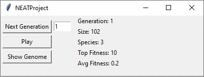
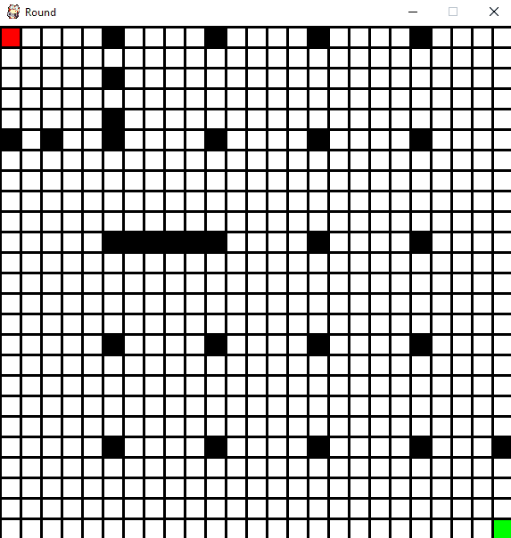
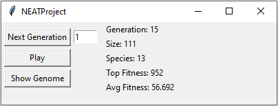
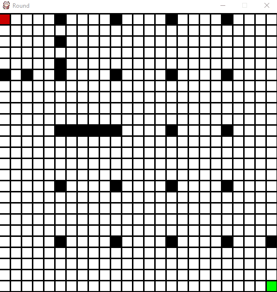

# NEATproject
Demonstration of NeuroEvolution of Augmenting Topologies (NEAT) genetic algorithm in action.\
The algorithm was created by Stanley and Miikkulainen explained in this [paper](http://nn.cs.utexas.edu/downloads/papers/stanley.ec02.pdf).

